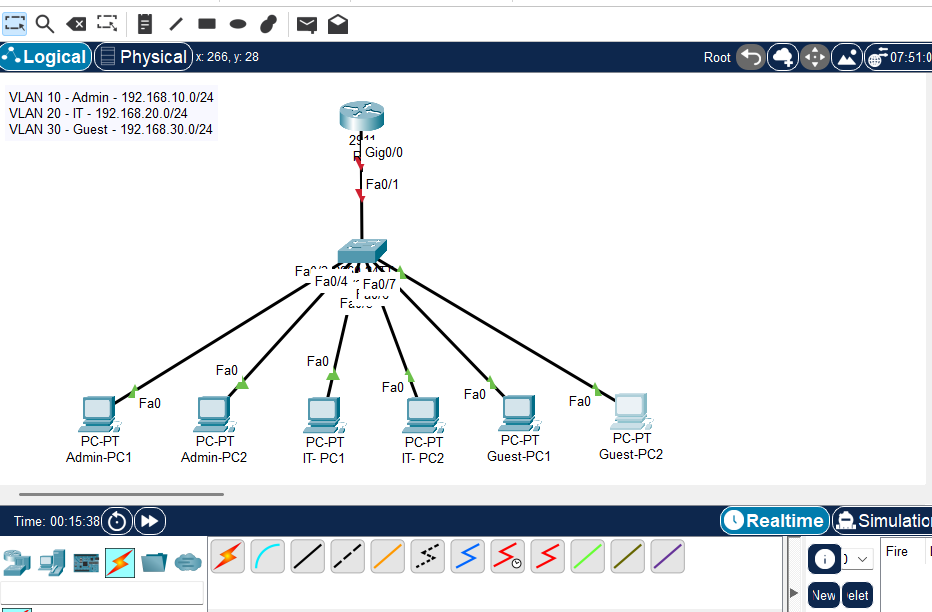

# Small Office Network Lab

## Project Overview
This project simulates a small office network using Cisco Packet Tracer. The network is divided into three departments: Admin, IT, and Guest. VLANs are used to separate department traffic, while router-on-a-stick inter-VLAN routing allows controlled communication between VLANs.

A basic access control list (ACL) is also applied to prevent the Guest VLAN from initiating access to the Admin VLAN while allowing other required network communication.

## Objectives
- Design a small office network topology
- Configure VLANs for different departments
- Configure trunking between the switch and router
- Configure router-on-a-stick inter-VLAN routing
- Configure DHCP for automatic IP addressing
- Apply a basic ACL for network control
- Test connectivity using ping
- Document configuration, testing, and troubleshooting steps

## Network Topology

## Network Departments

| Department | VLAN | Network | Default Gateway |
|-----------|------|---------|-----------------|
| Admin | VLAN 10 | 192.168.10.0/24 | 192.168.10.1 |
| IT | VLAN 20 | 192.168.20.0/24 | 192.168.20.1 |
| Guest | VLAN 30 | 192.168.30.0/24 | 192.168.30.1 |

## Tools Used
- Cisco Packet Tracer
- Cisco 2911 Router
- Cisco 2960 Switch
- PCs
- VLAN configuration
- Trunk configuration
- Router-on-a-stick
- DHCP configuration
- ACL configuration
- Ping testing

## Key Features Implemented
- VLAN segmentation for Admin, IT, and Guest departments
- Trunk link between router and switch
- Router-on-a-stick inter-VLAN routing
- DHCP pools for automatic IP assignment
- ACL rule to restrict Guest VLAN access to Admin VLAN
- Connectivity testing before and after ACL
- Troubleshooting documentation

## Evidence Screenshots

### VLAN Configuration

### DHCP Bindings

### Ping Test Before ACL

### ACL Test

## Project Files
- [Packet Tracer File](packet-tracer-file/small-office-network.pkt)
- [IP Addressing Plan](documentation/ip-addressing.md)
- [Configuration Commands](documentation/configuration-commands.md)
- [Testing Results](documentation/testing-results.md)
- [Troubleshooting Notes](documentation/troubleshooting-notes.md)

## Project Status
Completed.

## Resume Summary
Designed and configured a small office network in Cisco Packet Tracer using VLANs, trunking, router-on-a-stick inter-VLAN routing, DHCP, and ACLs. Documented IP addressing, configuration commands, testing results, and troubleshooting steps in GitHub.
