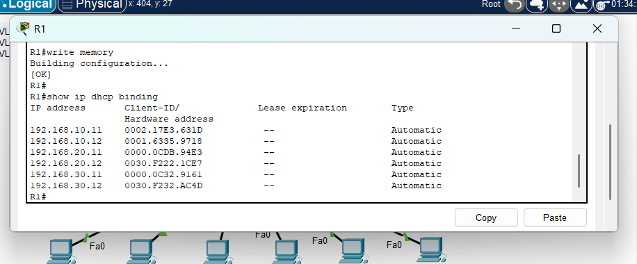
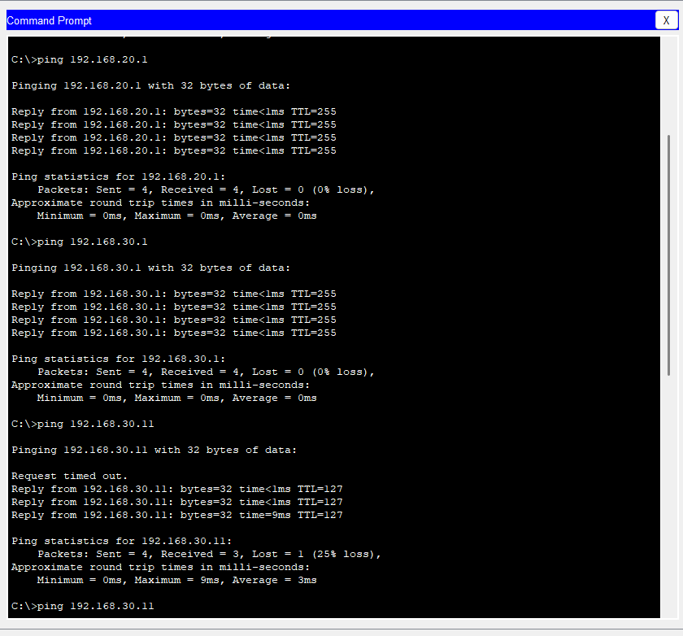

# Testing Results

This document contains the connectivity and verification tests performed in the Small Office Network Lab.

## DHCP Test Results

The router successfully assigned IP addresses to all PCs through DHCP.

| Device | VLAN | Assigned IP Address | Result |
|--------|------|---------------------|--------|
| Admin-PC1 | VLAN 10 | 192.168.10.11 | Success |
| Admin-PC2 | VLAN 10 | 192.168.10.12 | Success |
| IT-PC1 | VLAN 20 | 192.168.20.11 | Success |
| IT-PC2 | VLAN 20 | 192.168.20.12 | Success |
| Guest-PC1 | VLAN 30 | 192.168.30.11 | Success |
| Guest-PC2 | VLAN 30 | 192.168.30.12 | Success |

### DHCP Binding Screenshot

---

## Ping Tests Before ACL

Before applying the ACL, inter-VLAN routing was tested to confirm that devices from different VLANs could communicate.

| Test | Source | Destination | Expected Result | Actual Result |
|------|--------|-------------|-----------------|---------------|
| Test 1 | Admin-PC1 | 192.168.10.1 | Success | Success |
| Test 2 | Admin-PC1 | IT-PC1 / 192.168.20.11 | Success | Success |
| Test 3 | Admin-PC1 | Guest-PC1 / 192.168.30.11 | Success | Success |
| Test 4 | Guest-PC1 | Admin-PC1 / 192.168.10.11 | Success | Success |

### Ping Test Before ACL Screenshot

---

## Ping Tests After ACL

After applying the ACL, testing was performed to confirm that the Guest VLAN was blocked from initiating access to the Admin VLAN while other traffic remained allowed.

| Test | Source | Destination | Expected Result | Actual Result |
|------|--------|-------------|-----------------|---------------|
| Test 1 | Guest-PC1 | Admin-PC1 / 192.168.10.11 | Blocked | Success: Blocked |
| Test 2 | Guest-PC1 | IT-PC1 / 192.168.20.11 | Allowed | Success |
| Test 3 | Admin-PC1 | Guest-PC1 / 192.168.30.11 | Allowed | Success |

### ACL Test Screenshot

---

## Final Result

The lab successfully demonstrated VLAN segmentation, inter-VLAN routing, DHCP configuration, and ACL-based traffic control.
