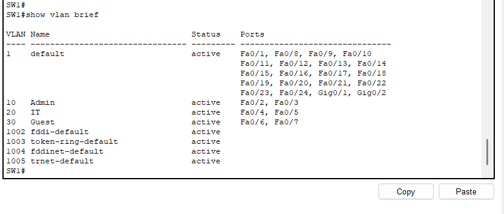

# Troubleshooting Notes

This document records the problems encountered during the lab and the steps used to fix them.

## Issue 1: Trunk Port Not Showing

**Problem:**  
The `show interfaces trunk` command did not display FastEthernet0/1 as an active trunk port.

**Cause:**  
The router interface connected to the switch was still administratively down. Because the other side of the link was down, the trunk did not become operational.

**Solution:**  
Enabled the router physical interface using the `no shutdown` command on GigabitEthernet0/0.

```cisco
interface gigabitEthernet 0/0
no shutdown
exit
```

**Verification:**  
After enabling the router interface and configuring router subinterfaces, the trunk link became active.

### Related Screenshot


---

## Issue 2: Admin VLAN Could Not Ping Guest VLAN After ACL

**Problem:**  
After applying the first ACL, Admin-PC1 could not ping Guest-PC1.

**Cause:**  
The ACL blocked all traffic from the Guest VLAN to the Admin VLAN. This also blocked ICMP echo-reply traffic from Guest-PC1 back to Admin-PC1.

**Solution:**  
Modified the ACL to allow ICMP echo-reply traffic from Guest VLAN to Admin VLAN before denying other Guest-to-Admin traffic.

```cisco
no access-list 100

access-list 100 permit icmp 192.168.30.0 0.0.0.255 192.168.10.0 0.0.0.255 echo-reply
access-list 100 deny ip 192.168.30.0 0.0.0.255 192.168.10.0 0.0.0.255
access-list 100 permit ip any any
```

**Verification:**  
Guest-PC1 could not ping Admin-PC1, but Guest-PC1 could ping IT-PC1. Admin-PC1 could also ping Guest-PC1 after allowing ICMP echo-reply traffic.

### Related Screenshot


---

## Lessons Learned

- Router interfaces must be enabled before trunk links become operational.
- VLANs require correct access port assignment on the switch.
- Router-on-a-stick requires subinterfaces with 802.1Q encapsulation.
- DHCP pools must match the VLAN networks.
- ACLs are processed from top to bottom.
- Standard deny rules can accidentally block return traffic, so testing is important.
